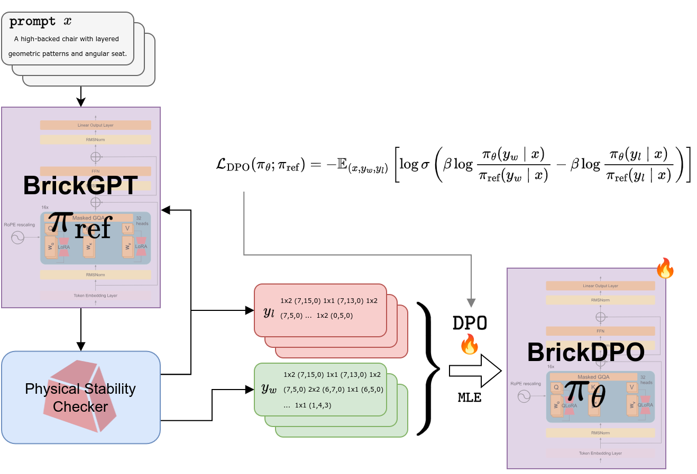
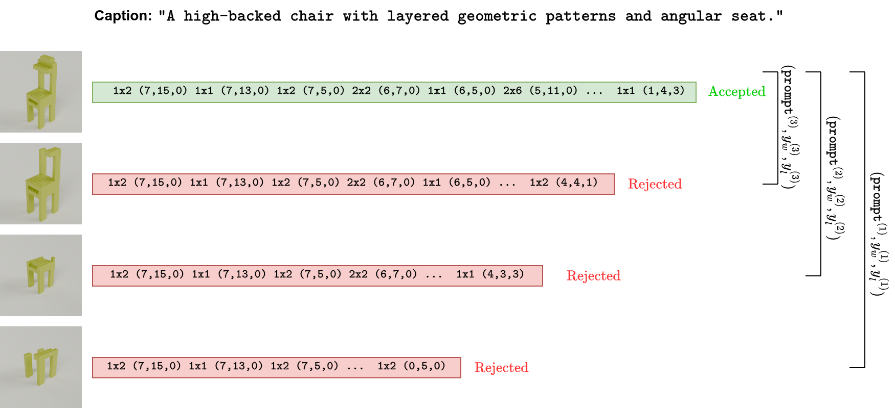

# BrickDPO: Stability Alignment for Physically Stable Brick Generation

[Kshitij Madhav Bhat](https://kshitijbhat.github.io/),
[Sreeharsha Paruchuri](https://sreeharshaparuchur1.github.io/),
[Annie Hu](https://www.linkedin.com/in/annie-hu-156695197)

Carnegie Mellon University

<!--  -->


BrickDPO is a framework for improving the physical stability of 3D LEGO-style structures generated by Large Language Models (LLMs). By applying **Direct Preference Optimization (DPO)**, we bake the "intuition" of structural integrity directly into the model's weights, drastically reducing the need for computationally expensive physics-check loops during inference.

---

## Problem Statement

Existing autoregressive models like **BrickGPT** generate 3D mesh structures token-by-token but often lack an inherent understanding of gravity and stress. They rely on a "physics-aware rollback" mechanism: if a structure becomes unstable, the system catches the error at test time, rolls back several steps, and tries again.

While effective, this is **inefficient**:

* **High Latency:** Constant calls to physics solvers (like Gurobi) slow down generation.


* **Cascading Failures:** One poorly placed brick early on can destabilize an entire downstream sequence.


## BrickDPO

We posit that a mesh generation model can be trained to be "secretly stability-aware". BrickDPO uses a hierarchical DPO framework to fine-tune a Llama-3.2-1B-Instruct model using preferences derived from successful and failed construction trajectories.

### Key Innovations

* **Dense Signal Generation:** Instead of simple (stable vs. unstable) pairs, we use the rollback mechanism as a "data oracle" to collect rich intermediate failure points.


* **Stable Prefix Masking:** We extend the prompt with the *stable* part of a structure and only calculate DPO loss on the divergence between a stable continuation and an unstable one. This solves the "credit assignment" problem.


* **LoRA Efficiency:** We utilize Low-Rank Adaptation (LoRA) to perform this alignment efficiently on consumer-grade hardware.

<!--  -->


---

## Performance & Results

| Metric | BrickGPT (Baseline) | BrickDPO (Ours) |
| --- | --- | --- |
| **Mean Regenerations** | 9.24 | **3.92** |
| **Mean Stability Score** | 0.9994 | **0.9997** |
| **Min Stability Score** | 0.9972 | **0.9988** |

Note: Lower regenerations indicate a more efficient model that "gets it right" the first time more often.

---

## Installation & Setup

This project uses `uv` for fast, reliable Python package management.

```zsh
# Create virtual environment and install dependencies
uv venv
source .venv/bin/activate
uv sync

```

---

## Usage Guide

### 1. Batch Inference & Data Collection

To run inference over a dataset and record rejection/stability statistics:

```zsh
uv run batch_infer --dataset <parquet_file> --experiment_name <expt_name> --max_samples 100

```

* **Outputs:** Saves `.csv` files containing rejection reasons, regeneration counts, and timing data in `proj_develop/batch_outputs/`.


### 2. Visualizing Results

Generate histograms and summary plots from your inference runs:

```zsh
python proj_develop/eval_stats.py --output_dir_prefix <path_to_results>

```

### 3. Fine-Tuning with DPO

To start the training process (ensure you are logged into `wandb`):

```zsh
uv run fine_tune_dpo.py

```

* **Key Configs:** You can adjust `lora_r`, `beta`, and `max_prompt_length` within the `ScriptArguments` class in the script.

### 4. Baseline Evaluation

For a streamlined evaluation of the baseline model without DPO:

```zsh
uv run eval_baseline --dataset test_sets/test_set_maxlen_2048_topk_100.parquet --output_name baseline_run

```

---

## Project Structure

* `fine_tune_dpo.py`: Core training script using TRL's `DPOTrainer` and 4-bit quantization.


* `prepare_dpo_dataset.py`: Builds a JSONL dataset from raw inference logs, identifying "chosen" vs "rejected" paths.


* `eval_utils.py`: Utility module for processing JSONL logs into pandas DataFrames for analysis.


## Models on Hugging Face

* **Best (Partial Structures):** `kshitij-hf/brickgpt_partial`
* **Base DPO (2500 tokens):** `kshitij-hf/brick-dpo-base-2500`

---